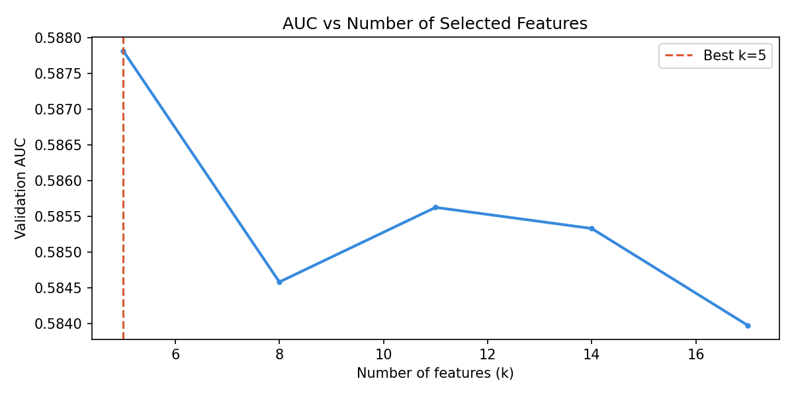
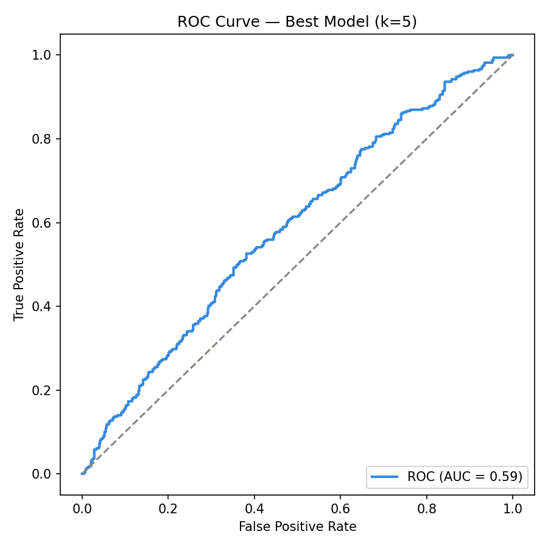
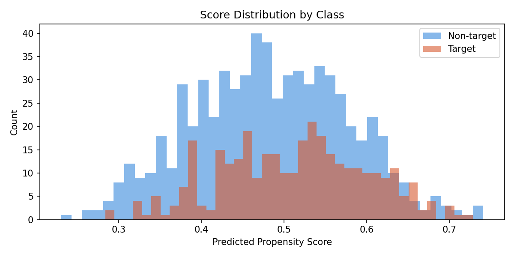
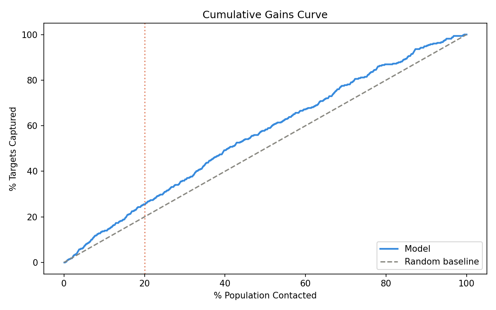

# Marketing Propensity Pipeline

End-to-end machine learning pipeline for predicting customer propensity
to respond to a marketing campaign.

The pipeline covers the full model lifecycle: synthetic data generation,
preprocessing, automated feature selection with MLflow tracking, model
evaluation, and visualisation of results.

---

## Business context

Marketing teams need to prioritise which customers to contact in a
campaign. Contacting everyone is costly — contacting the wrong people
wastes budget and risks customer fatigue. This pipeline scores each
customer with a propensity probability, enabling the team to focus
outreach on the highest-potential segments.

---

## Project structure

    marketing-propensity-pipeline/
    ├── generate_data.py       # Synthetic customer dataset generator
    ├── train.py               # Preprocessing, feature selection, training
    ├── customer_data.parquet  # Generated dataset (5 000 customers)
    ├── sweep_results.csv      # AUC scores across all k values
    └── plots/
        ├── auc_vs_k.png           # Feature selection sweep results
        ├── roc_curve.png          # ROC curve for best model
        ├── score_distribution.png # Predicted score by class
        └── cumulative_gains.png   # Gains curve vs random baseline

---

## Installation

```bash
git clone https://github.com/pingyan-data/marketing-propensity-pipeline.git
cd marketing-propensity-pipeline
python3 -m venv venv
source venv/bin/activate
pip install pandas numpy scikit-learn xgboost mlflow matplotlib tqdm
```

---

## Usage

**Step 1 — Generate synthetic customer data:**

```bash
python generate_data.py
```

**Step 2 — Run the training pipeline:**

```bash
python train.py
```
---

## Results

### Feature selection sweep

The pipeline tests multiple values of k (number of selected features)
and picks the one with the highest validation AUC. Here k=5 performs
best — adding more features does not improve the model, which suggests
the signal is concentrated in a small number of customer attributes.



### ROC curve



### Score distribution by class

The predicted propensity scores for target and non-target customers
show partial separation, confirming the model has learned a meaningful
signal despite the noisy synthetic data.



### Cumulative gains

Targeting the top 20% of customers by propensity score captures
approximately 25% of all actual targets — outperforming random selection
and demonstrating the practical value of the model for campaign
prioritisation.



---

## Dataset features

| Feature | Type | Description |
|---|---|---|
| `age` | Numerical | Customer age |
| `gender` | Binary | Gender (0/1) |
| `region` | Categorical | Geographic region |
| `segment` | Categorical | Customer segment |
| `housing_type` | Ordinal | Type of housing |
| `has_car` | Binary | Car ownership (0/1) |
| `income_index` | Ordinal | Relative income level (1–5) |
| `product_holdings` | Ordinal | Number of products held (1–7) |
| `tenure_months` | Numerical | Months as a customer |
| `digital_score` | Ordinal | Digital engagement level (1–4) |
| `activity_score` | Ordinal | Activity level (1–4) |
| `engagement_level` | Ordinal | Overall engagement (1–4) |
| `campaign_contacts` | Numerical | Previous campaign contacts |
| `target` | Binary | Responded to campaign (1 = yes) |

---

## Pipeline design

**Preprocessing** handles each feature type appropriately:
- Numerical features → mean imputation + min-max scaling
- Categorical features → mode imputation + one-hot encoding
- Ordinal features → mode imputation + ordinal encoding
- Binary features → mode imputation + binarization

**Feature selection** uses `SelectKBest` with ANOVA F-scores to
automatically identify the most predictive features, sweeping over
a range of k values with each run tracked in MLflow.

**Model** is a class-weighted Logistic Regression, appropriate for
imbalanced campaign response data.

---

## Tech stack

- Python 3.9+
- pandas, scikit-learn, MLflow, matplotlib

---

## License

MIT